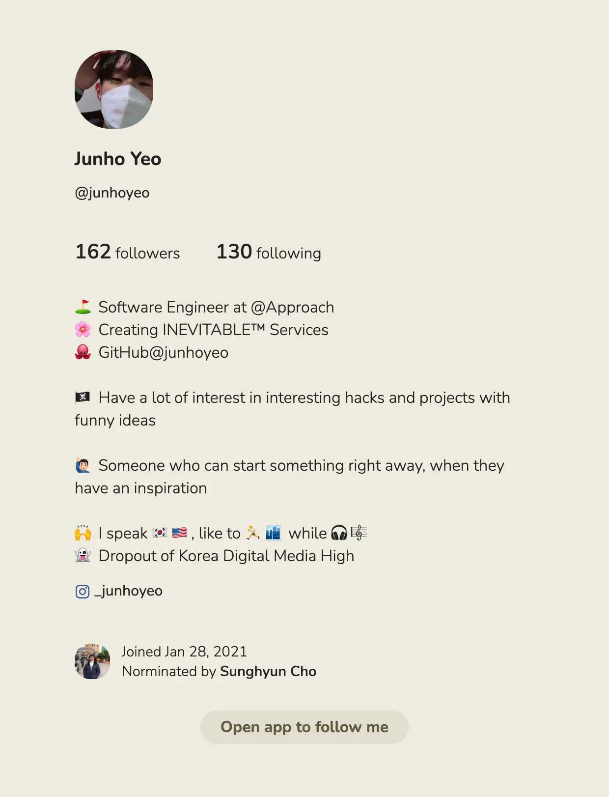
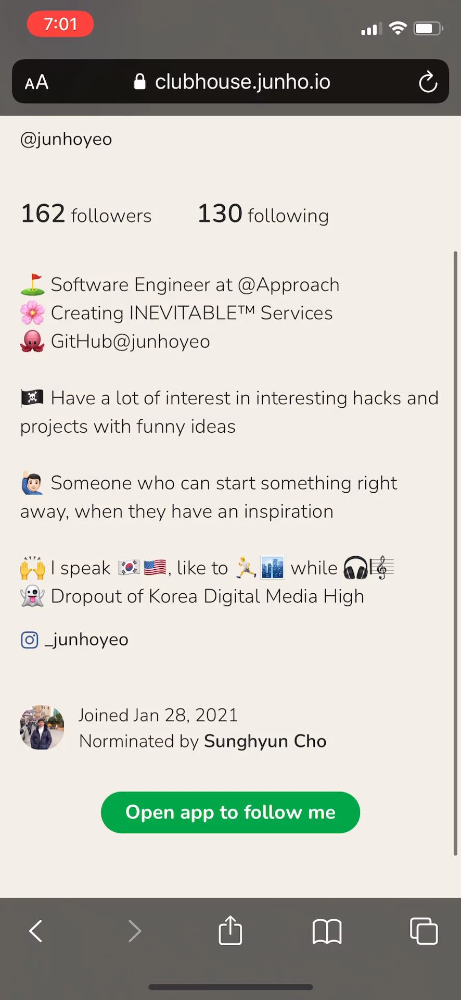
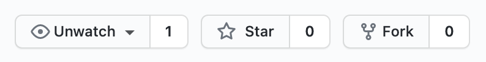
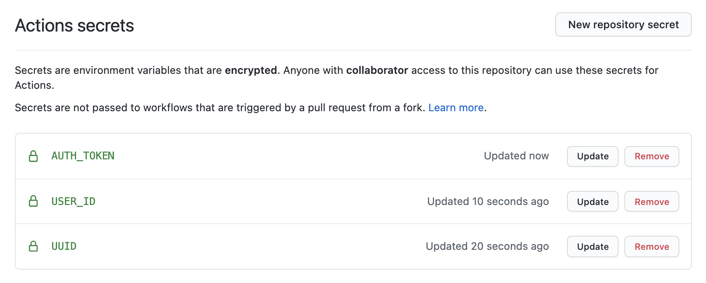
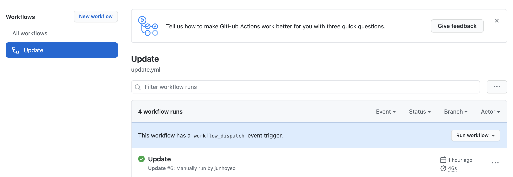

# Clubhouse Profile
🌸 Make your own profile from Clubhouse and host it on the web.

This repository uses [React](https://github.com/facebook/react) & [Next.js](https://github.com/vercel/next.js/) for the frontend, and to update your profile weekly, [Axios](https://github.com/axios/axios)(we create the client to communicate with the Clubhouse API), and [GitHub Actions](https://docs.github.com/en/actions)(for scheduling updates with cronjob).

<div align="center">
  <a href="https://clubhouse.junho.io">
    
  </a>
  <blockquote>👋 Your <a href="https://www.joinclubhouse.com/">Clubhouse</a> profile, <strong>on the web</strong></blockquote>
</div>

## Open, Paste, and Follow

<div align="center">
  <a href="https://clubhouse.junho.io">
    
  </a>
  <blockquote>
    ✅ Open the Clubhouse app with the button,<br />
    and your nickname gets <strong>automatically copied</strong> to the clipboard!
  </blockquote>
</div>

## 🚀 Create your own
Follow this tutorial to have your own Clubhouse profile in the web 🙌

### 1. Fork this repository on GitHub
You can **fork** this repository with the branch-like icon placed on the top right. Press that and this repo will be cloned to your GitHub account.



If you liked this project, you can also give me a **star** anytime! ⭐️

### 2. Set Actions secrets
Now you should set the environment variables required to fetch/update your profile.



Set the necessary values with each key.

- You'll need authentication to get the values `AUTH_TOKEN` and `USER_ID`(If you don't know yours).
  - I once made a [Jupyter Notebook](https://github.com/junhoyeo/graphclubhouse/blob/master/notebook.ipynb) on some other project for this task. You can either use [other known clients of Clubhouse](https://github.com/search?o=desc&q=clubhouse&s=updated&type=Repositories) or follow other tutorials.
  - If you need help, please leave an issue [here](https://github.com/junhoyeo/clubhouse-profile/issues), and I'll make some kind of crazy things to go through this task or just help you when I have spare time, or hopefully, the community will help. 😁
- `UUID` is just a random UUIDv4 value used to determine devices, so you can generate it [here](https://www.uuidgenerator.net/version4) or somewhere else.

You can specify the values in the project root's `.env` file, and run the command `yarn update` to update your profile manually in your machine.
See the file `.env.example` for reference.

### 3. Deploy your app

```bash
# Install dependencies
$ yarn

# Build your profile
$ yarn build
```

- You can host the output files after the build ends, following the command above.
- Or you can use cloud platforms like [Vercel](https://vercel.com/), [Netlify](https://www.netlify.com/), .etc.
  - I'm a huge fan of Vercel, by the way(disclaimer: sadly, I'm not related to this company, but would like to). It makes me ship my ideas right away for most of the projects I do, saving me a lot of time.
  - One of the good reasons to use them is because they can **connect to GitHub repositories**. In our case, the Workflow retrieves your profile information every Monday and commits the changes. Vercel or Netlify can reflect the changes to your deployment automatically.

### 4. Run your workflow
The Workflow is **scheduled to run every Monday, UTC 00:00**(In Korean time it's 09:00).



In case you want to run the Workflow manually, it has a `workflow_dispatch` trigger so you can run it in the GitHub Actions tab anytime you want.
